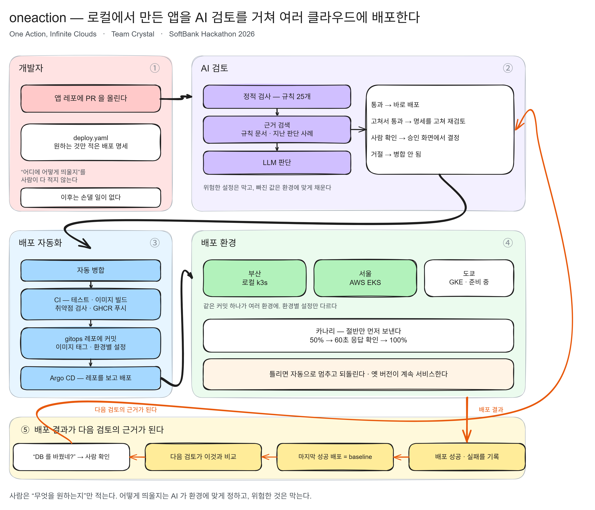

# gitops



> 위 그림 ③ 의 **"gitops 레포에 커밋"** 과 **Argo CD** 가 이 레포입니다. 검토를 통과한 명세와 CI 가 빌드한 이미지 태그가 여기로 모이고, Argo CD 가 각 환경에 배포합니다.
> 그림 원본은 [docs/architecture.excalidraw](docs/architecture.excalidraw) (Excalidraw).

Argo CD가 바라보는 배포 설정 레포입니다. 앱 레포의 CI가 이미지 태그를 갱신하면 Argo CD가 각 클러스터에 자동으로 동기화합니다. **사람이 이 레포를 직접 고치는 일은 거의 없습니다.**

```
apps/sample-app/
  base/                      공통 Rollout·Service·AnalysisTemplate (이미지 태그는 CI가 갱신)
  overlays/local/            부산 로컬 (k3s)
  overlays/aws/              서울 (EKS, ap-northeast-2)
  overlays/gcp/              도쿄 (GKE, asia-northeast1)
apps/review-service/         검토 서비스. AWS EKS platform 네임스페이스 전용
                             Review API · 워커 · Qdrant · 시크릿 · 플랫폼 ALB 연결
argocd/                      클러스터별 Argo CD Application
  install/                   Argo CD · Argo Rollouts 설치 순서와 버전, 재조회 주기
  notifications/             배포 결과를 검토 서비스로 보내는 설정
```

렌더링 확인: `kubectl kustomize apps/sample-app/overlays/aws`

## 누가 이 레포에 커밋하나

세 곳이 커밋합니다. 같은 시점에 겹칠 수 있어 **push 충돌 시 재시도**가 모두 들어가 있습니다.

| 누가 | 무엇을 |
| --- | --- |
| sample-app CI | `apps/sample-app/base` 의 이미지 태그 |
| review-service CI | `apps/review-service` 의 이미지 태그 |
| `commit_overlay` (검토 워커) | 검토를 통과한 명세로 만든 `overlays/<env>/` |

## 배포 방식

### 카나리 — 절반만 먼저 내보낸다

```
새 이미지 → 50% (복제본이 3개면 새 버전 2개 + 옛 버전 1개)
         → 60초 동안 두 가지 확인 (10초마다 6번)
              ① 앱이 제대로 응답하는지      (api-ok)
              ② 카나리 파드의 5xx 비율      (error-rate)
         → 둘 다 멀쩡하면 100%, 하나라도 틀리면 중단하고 되돌림
```

단계는 `apps/sample-app/base/rollout.yaml`, 확인 기준은 `base/analysistemplate.yaml` 에 있습니다. 명세의 `rollout.strategy` 가 `canary` 면 이 설정을 그대로 쓰고, `bluegreen` 이면 렌더러가 전략을 통째로 바꿉니다.

지표가 둘인 이유는 각자 못 보는 게 있기 때문입니다.

| | 잡는 것 | 못 잡는 것 |
| --- | --- | --- |
| `api-ok` (앱을 직접 부름) | 응답이 **계속** 틀린 경우 — 잘못된 이미지, 설정 오류 | 일부 요청만 실패하는 경우. Service 가 카나리·안정 파드를 함께 가리켜 요청이 번갈아 가므로 연속 오류가 잘 안 생긴다 |
| `error-rate` (Prometheus) | **부분 에러율** — "새 버전이 10% 요청만 500 을 준다" | 트래픽이 없으면 아무것도 못 본다 |

`error-rate` 는 `rollouts_pod_template_hash` 로 **카나리 파드만** 골라서 잽니다. 카나리 중에는 새 파드와 옛 파드가 같은 Service 뒤에 함께 있어서, 이 라벨이 없으면 지표가 섞여 "새 버전만 에러가 난다" 가 희석됩니다.

#### 🔴 `error-rate` 는 트래픽이 있어야 의미가 있습니다

`/healthz` 를 일부러 뺐습니다. readiness·liveness 가 5초·10초마다 때리므로 섞으면 사용자 요청의 실패가 묻힙니다. 실측하니 전체 0.87 req/s 가 전부 헬스체크였고 사용자 요청은 0 req/s 였습니다.

**데모에서 부분 실패를 보여주려면 카나리가 도는 동안 요청을 넣어야 합니다.**

```bash
# 카나리 60초 동안 초당 몇 번씩 때린다
ALB=k8s-sampleap-sampleap-88af4f1f82-400100408.ap-northeast-2.elb.amazonaws.com
end=$((SECONDS+90)); while [ $SECONDS -lt $end ]; do curl -s -o /dev/null "http://$ALB/api/info"; sleep 0.2; done
```

트래픽이 없을 때는 **배포를 막지 않습니다**(측정값 0 으로 통과). 아무도 안 쓰는 앱의 배포를 세워두는 것보다 낫다고 봤습니다.

#### 로컬에는 Prometheus 가 없습니다

`base` 를 두 환경이 공유하므로 `error-rate` 는 로컬 k3s 에서 매번 `Error` 가 됩니다. 그래서 `consecutiveErrorLimit` 을 `count` 와 같게 둬서 **오류로는 절대 중단되지 않게** 했습니다.

Prometheus 가 꺼져 있어도 배포를 막지 않는다는 뜻이기도 합니다. 그때의 안전망은 `api-ok` 입니다. 환경별로 다르게 하려면 `base` 를 분리해야 하는데, 지금 필요한 변경이 아닙니다.

### 헬스체크 실패 시 자동 롤백

새 버전이 60초(`progressDeadlineSeconds`) 안에 헬스체크(`/healthz`)를 통과하지 못하면 배포를 중단하고 기존 버전을 계속 서비스합니다. 카나리 분석과 별개로 동작하는 더 바깥의 안전장치입니다.

### 명세에 없는 리소스는 지워진다

`overlays/<env>/` 는 **생성물**입니다. `commit_overlay` 가 명세로 다시 만들면서, 이전에 있었는데 새 명세에 없는 파일은 지웁니다. 남겨두면 kustomize가 없는 리소스를 참조하기 때문입니다.

> ⚠️ 2026-10-09에 이것 때문에 장애가 있었습니다. 명세가 없는 PR에서 축소된 명세가 자동 생성·병합되어 `ingress.yaml` 이 지워지고, Argo CD prune → ALB까지 삭제됐습니다. 지금은 **기존 overlay의 Ingress가 사라지는 변경을 `commit_overlay` 가 `blocked` 로 막습니다.**

## 설치

버전과 순서는 [argocd/install/README.md](argocd/install/README.md)를 따릅니다. Argo CD **v3.5.4**, Argo Rollouts **v1.10.0** 으로 고정합니다. `stable`·`latest` 를 쓰면 환경마다 버전이 달라집니다.

배포 결과를 검토 서비스로 보내는 설정은 [argocd/notifications/README.md](argocd/notifications/README.md)에 있습니다.

## Application 목적지

| 파일 | `destination.server` | 상태 |
| --- | --- | --- |
| `sample-app-aws.yaml` | `https://kubernetes.default.svc` | 적용됨. Argo CD가 EKS 안에 있어 in-cluster가 맞습니다 |
| `review-service-aws.yaml` | `https://kubernetes.default.svc` | 적용됨 |
| `sample-app-local.yaml` | `LOCAL_K3S_API_SERVER` | **아직 적용하지 않습니다** |
| `sample-app-gcp.yaml` | `GCP_GKE_API_SERVER` | **아직 적용하지 않습니다** |

**운영 모델에 따라 `local`·`gcp` 의 값이 달라집니다.**

- **EKS의 Argo CD 하나로 세 환경을 관리**하면 → 클러스터를 Argo CD에 등록하고 그 주소(또는 `destination.name` 으로 등록한 이름)를 넣습니다
- **환경마다 Argo CD를 따로 설치**하면 → 그 클러스터 안에서는 `https://kubernetes.default.svc` 가 맞습니다

> ⚠️ 하나로 관리하면서 `local` 에 `kubernetes.default.svc` 를 넣으면 **로컬 설정이 EKS에 배포됩니다.** 네임스페이스가 둘 다 `sample-app` 이라 `aws` overlay와 같은 Rollout·Service·Ingress를 서로 밀어냅니다.

## 로컬(부산) 환경 실행

k3d 클러스터 안에 Argo CD를 따로 설치하는 방식입니다. 이 경우 Application의 목적지는 그 클러스터 자신입니다.

```bash
k3d cluster create crystal-busan --agents 1 -p "127.0.0.1:8081:80@loadbalancer"

kubectl create namespace argocd
kubectl apply -n argocd --server-side \
  -f https://raw.githubusercontent.com/argoproj/argo-cd/v3.5.4/manifests/install.yaml
kubectl create namespace argo-rollouts
kubectl apply -n argo-rollouts --server-side \
  -f https://github.com/argoproj/argo-rollouts/releases/download/v1.10.0/install.yaml

# 목적지를 이 클러스터로 바꿔서 적용한다 (레포의 플레이스홀더는 그대로 둔다)
sed 's|LOCAL_K3S_API_SERVER|https://kubernetes.default.svc|' argocd/sample-app-local.yaml \
  | kubectl apply -f -
```

접속: http://localhost:8081

포트를 `127.0.0.1:` 로 묶은 이유는, 그냥 `8081:80` 으로 두면 모든 인터페이스에 열려 같은 네트워크의 다른 기기에서도 접속되기 때문입니다. 다른 기기로 시연할 계획이면 이 접두어를 빼야 합니다.

Windows에서 kubectl 연결이 안 되면: `kubectl config set-cluster k3d-crystal-busan --server=https://127.0.0.1:<포트>`

**카나리 분석이 로컬에서도 돌려면** 그 클러스터에 Argo Rollouts가 설치돼 있어야 합니다. `AnalysisTemplate` 은 `base` 에 있어 overlay를 쓰면 자동으로 따라갑니다.

로컬에는 `monitoring` 네임스페이스가 없어서 `error-rate` 지표가 매번 `Error` 가 됩니다. 중단되지는 않습니다 — 위 "로컬에는 Prometheus 가 없습니다" 참고.
